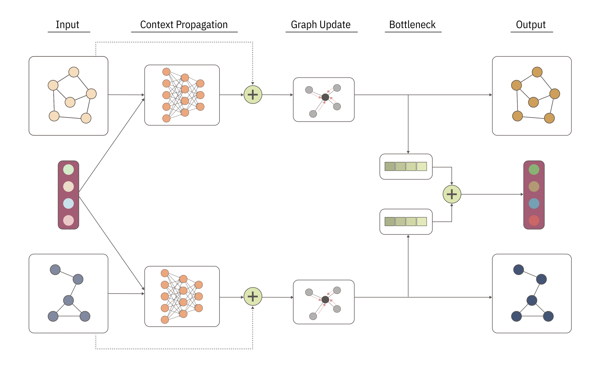

# CongFu

This is the official codebase for **CongFu: Conditional Graph Fusion for Drug Synergy Prediction**.



## What is CongFu?

Drug synergy, characterized by the amplified combined effect of multiple drugs, presents a critical phenomenon for optimizing therapeutic outcomes. However, limited data on drug synergy, arising from the vast number of possible drug combinations and computational costs, motivate the need for predictive methods. In this work, we introduce CongFu, a novel Conditional Graph Fusion Layer, designed to predict drug synergy. CongFu employs an attention mechanism and a bottleneck to extract local graph contexts and conditionally fuse graph data within a global context. Its modular architecture enables flexible replacement of layer modules, including readouts and graph encoders, facilitating customization for diverse applications. To evaluate the performance of CongFu, we conduct comprehensive experiments on four datasets, encompassing three distinct setups for drug synergy prediction. Remarkably, CongFu achieves state-of-the-art results on 11 out of 12 benchmark datasets, demonstrating its ability to capture intricate patterns of drug synergy. Through extensive ablation studies, we validate the significance of individual layer components, affirming their contributions to overall predictive performance. By addressing the challenge of predicting drug synergy in untested drug pairs, CongFu opens new avenues for optimizing drug combinations and advancing personalized medicine. More details can be found in the [paper](https://arxiv.org/abs/2305.14517).

## Installation
The following command will install the required packages for CongFu with virtual environment:

```bash
python create -n congfu python=3.9
conda activate congfu
cd CongFu
pip install -e .
```

## Loading Preprocessed Data
All datasets used in the paper can be downloaded via the commands:
```bash
wget -P ./data/preprocessed https://www.dropbox.com/s/91z87vf857o12pz/drugcomb.zip
unzip ./data/preprocessed/drugcomb.zip -d ./data/preprocessed
rm ./data/preprocessed/drugcomb.zip
```

## Preprocessing
To replicate preprocessing:
* Download `Gene Expression` data and `Drug Combination` data via the commands:
```bash
wget -P ./data/init https://www.cancerrxgene.org/gdsc1000//GDSC1000_WebResources//Data/preprocessed/Cell_line_RMA_proc_basalExp.txt.zip
unzip ./data/init/Cell_line_RMA_proc_basalExp.txt.zip -d ./data/init
rm ./data/init/Cell_line_RMA_proc_basalExp.txt.zip
wget -P ./data/init https://drugcomb.fimm.fi/jing/summary_v_1_5.csv
```
* For each synergy score (`loewe`, `zip`, `hsa`, `bliss`) run following commands:
```bash
python preprocessing/process_drugcomb.py --synergy_score your_score
python preprocessing/create_transductive_splits.py --synergy_score your_score
python preprocessing/create_transductive_splits.py --synergy_score your_score
```

## Training

The following command will train CongFu-based model on the first fold on leave-comb inductive setup:
```bash
python train.py --num_layers 5 --inject_layer 3 --emb_dim 300 --feature_dim 512 --context_dim 908 --synergy_score loewe --inductive_set_name leave_comb --fold_number 0 --batch_size 128 --lr 1e-4 --number_of_epochs 100
```

## Citation

```bibtex
@misc{tsepa2023congfu,
      title={CongFu: Conditional Graph Fusion for Drug Synergy Prediction}, 
      author={Oleksii Tsepa and Bohdan Naida and Bo Wang},
      year={2023},
      eprint={2305.14517},
      archivePrefix={arXiv},
      primaryClass={cs.LG}
}
```
